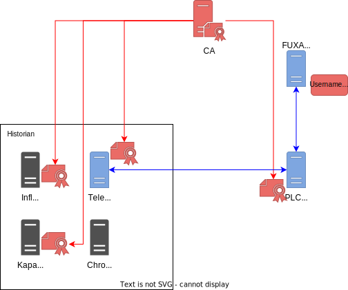
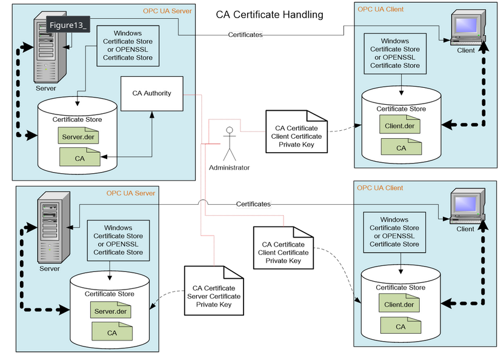

# Certificates, Authentication and Acess Control

The testbed uses a PKI for purposes of authentication and message protection. FUXA (HMI) does not use certificates for OPC UA, due to a lack of support.

## PKI

The PKI was implemented with **OpenSSL**. It has a root certificate authority (CA) and an intermediate CA, that signs the application certificates. The root CA is only used to sign the intermediate CA and potentially revoke it.

It issues the following certificates:

## Authentication

The certificates are used to authenticate the OPC UA clients and servers.
As well as TICK stack components mutually.
As mentioned, all these certificates are signed by the intermediate CA.

For OPC UA **all CAs have to maintain a CRL**, these are distributed to the applications alongside the CA certificate.

The following image (taken from the OPC UA specification) again shows are certificates are supposed to be used in OCP UA.

## Access Control

We use the certificates to identify the clients that connect to the server.
The identities are then internally mapped to roles.
Each of these roles has different capabilities.
We define three different roles:

- observers: read only access
- operators: can change values for input variables, e.g. turn the controller logic on and off.
- admins: unrestricted rights.

In our case we give the HMI the operator role and the historian an observer role.

Additionally, we also restrict writing to variables is undesirable.
For instance, writing to sensor values aggregated by the PLC obviously is something that we don't want to allow. 

## References

For more details on how OPC UA uses certificates refer to:
- [https://reference.opcfoundation.org/v104/Core/docs/Part2/8/](https://reference.opcfoundation.org/v104/Core/docs/Part2/8/)
- Chapter 2.3 of 'Praxishandbuch OPC UA' (2nd edition, German, ISBN 978-3-8343-3454-1)

<!-- https://reference.opcfoundation.org/v104/GDS/docs/7.1/ -->
