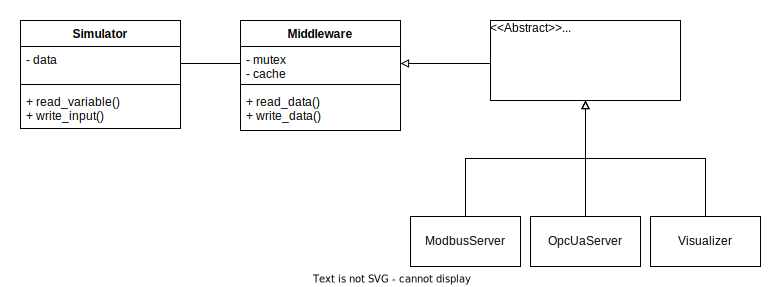

# The Components

The testbed uses of open-source components and libraries to address important aspects of control networks.

## OpenPLC

OpenPLC is a fully open-source PLC, that can either be run on microcontrollers or as a software-PLC.
It targets the IEC 61131-3 standard for PLCs and supports the following programming languages: Ladder Logic (LD), Function Block Diagram (FBD), Instruction List (IL), Structured Text (ST), and Sequential Function Chart (SFC). These programs can be written with [OpenPLC Editor](https://www.openplcproject.com/plcopen-editor/).

OpenPLC was forked for this testbed, in order to provide [OPC UA](./protocols.md#opc-ua) support. The reason for this fork was the lack of an open-source PLC that supports OPC UA. OPC UA functionality uses the [open62541 library](./components.md#open62541).
Complying with the [PLCOpen companion standard(s)](https://opcfoundation.org/markets-collaboration/plcopen/) was not the goal of this project and is left for future work.

The project website can be found [here](https://www.openplcproject.com/). The source-code of the fork that is used in this testbed can be found [here](https://github.com/vembacher/OpenPLC_v3).

## HMI (FUXA)

The HMI software is FUXA. Which has a Node.js backend and an Angular frontend.
It can connect to: Modbus RTU/TCP, Siemens S7 Protocol, OPC-UA, BACnet IP, MQTT, Ethernet/IP (Allen Bradley).
More information can be found in the [GitHub repository](https://github.com/frangoteam/FUXA).

## Historian (TICK Stack)

The historian is built with the [TICK stack](https://www.influxdata.com/time-series-platform/) (Telegraf, InfluxDB, Chronograf, Kapacitor).
InfluxDB is a time-series database, Telegraf is a data-collection agent and Chronograf is a dashboard software.
Telegraf uses Modbus and OPC UA to gather data from the PLC and stores it in the database, which is then visualized with Chronograf.

## Physical Process Simulator and Visualizer

Physical processes are an essential part of a control network, realizing them with real-world equipment is unfeasible in many cases, due to being very expensive.
The physical process of our testbed is entirely virtual and implemented with software simulation. The simulator is written Python and very modular, it is shown in the following image.

The simulation itself is handled by the `Simulator` object, the `Middleware` implements an interface to access the data from the simulation and handles synchronization and caching (in order to reduce load on the simulation model).
The abstract `Server` can be used to extend the simulator with new protocols, we implemented this for Modbus (using the PyModbus library) and OPC UA (using the asyncua library).

Additionally, we also implemented a simple web application that visualizes the physical process independently of any outside interference (such as attackers).

All of the components run in their own thread(s).

## Attacker

The attacker host is a Kali Linux container to which we can connect via SSH.

## Libraries

The testbed used a number of open source libraries, including open62541, PyModbus and asyncua.

### open62541

`open62541` is one of the major open-source implementations of OPC UA, it is platform independent and written in the common subset of C99 and C++98. It [is certified](https://open62541.org/certified-sdk.html) by the OPC Foundation.
The library is a low-level library, which allows high customizability and low-level control.

As mentioned, it is used in the OpenPLC fork maintained for this testbed.

The project is housed [here](https://open62541.org/), the documentation can be found [here](https://open62541.org/doc/current/) and the source code [here](https://github.com/open62541/open62541).

### PyModbus

The simulator uses the PyModbus library to implement a Modbus server. The documentation can be found [here](https://pymodbus.readthedocs.io/en/latest/) and the GitHub repository [here](https://github.com/riptideio/pymodbus).

### asyncua

`asyncua` is used implement the OPC UA server of the simulator. The github repository can be found [here](https://github.com/FreeOpcUa/opcua-asyncio).