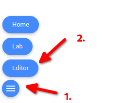
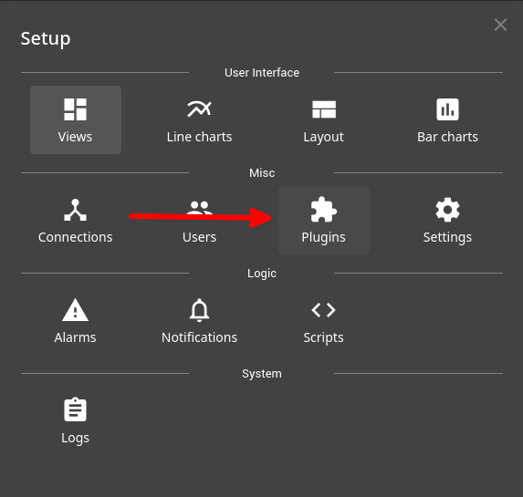
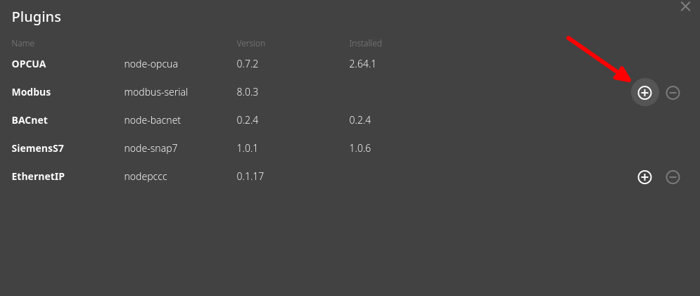
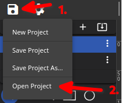

# Setting up FUXA

1. Go to <https://hmi-plctb.aisec.fraunhofer.de> or <http://localhost:4001> 
2. Press on the burger menu and click on editor.

3. Press on the cogwheel in the upper left corner and select `Plugins`.

4. Enable the Modbus plugin and press OK.

5. Press the floppy disk icon and select `Open Project` and navigate to the file `v3/FUXA/fuxa-config.json`.

6. Press the burger menu and select `Lab`

