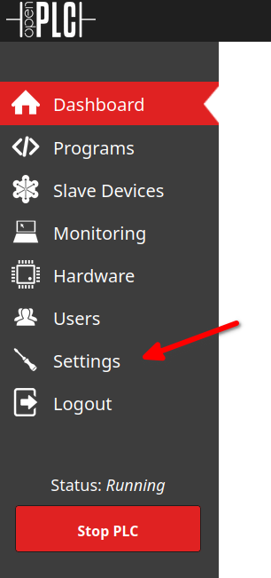
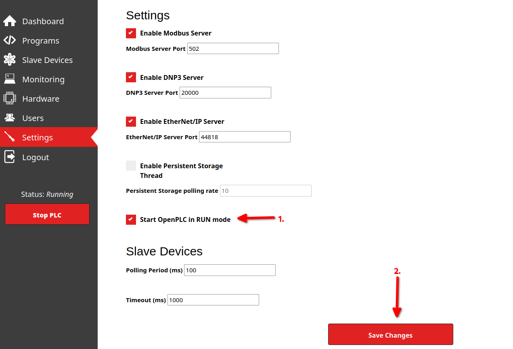
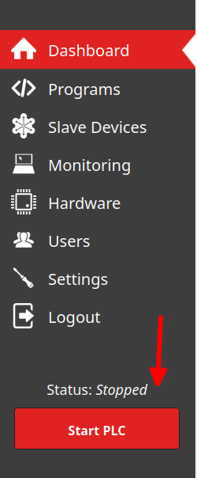

# Setting up OpenPLC

1. Go to <https://plc-plctb.aisec.fraunhofer.de> or <http://localhost:4004>
2. Login with default credentials, `openplc` for both username and password.
3. On the sidebar click on `Settings`.

4. Enable the toggle `Start OpenPLC in RUN mode`.

5. Press ’Start PLC’ button.

Additionally consult the [OpenPLC documentation](https://www.openplcproject.com/reference/).