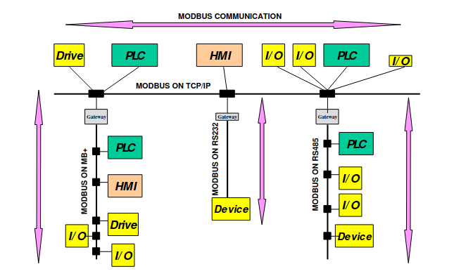
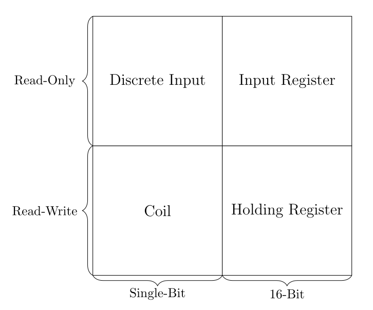
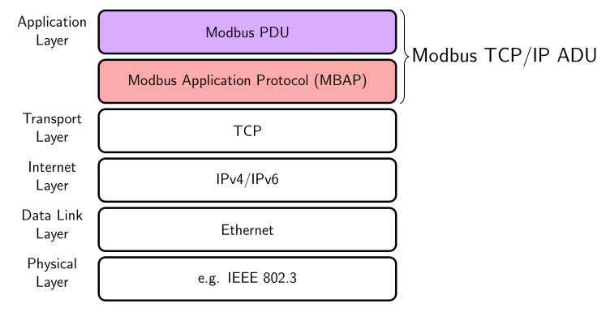

# Industrial Protocols

The testbed uses two major industrial protocols, Modbus and OPC UA.
The former is a quite old protocol, and has been used in industry for many decades.
The latter is newer and has been gaining popularity in the industrial world in the context of the 4th industrial revolution (Industry 4.0).

## Modbus

Modbus is a server-client protocol that can be used at the field level. The following image shows possible use cases, it is taken from the Modbus Specification.

It structures data into four different tables: coils, discrete inputs, input registers and holding registers.
Each have different data sizes and access rights (for clients). This is illustrated by the following picture. 

Modbus can be used on top of different protocols stacks, such as serial connections or TCP/IP.
The serial version is called Modbus RTU and the TCP/IP version is simply called Modbus TCP/IP.
The protocol slightly differs depending on the protocol stack.

### Issues with Modbus

Due to a number of reasons, Modbus suffers from multiple problems.

The first issue is a complete lack of cryptography in the base protocol, which misses encryption and message authentication.
The second is the very rudimentary level of access control, which (in the base protocol) is limited to the read/write access of the different tables.
A mechanism that is more suitable to data modelling rather than proper access control.
Furthermore, it also allows a very low degree of data modelling due to being restricted into using the four previously mentioned tables.
This also affects scalability as Modbus servers with many data points can become unwieldy to use. 

This is caused by it being a very old protocol, developed during a time where control networks faced different constraints. 
There are initiatives to address issues related to security, for instance, the 'Modbus Security Protocol'.
It adds cryptography and role-based access control.
However, this improvement requires retro-fitting and has not been widely adopted.

### Resources

- All specifications related to Modbus are available [here](https://modbus.org/specs.php).
- How Modbus is used in OpenPLC can be found [here (server)](https://www.openplcproject.com/reference/modbus-slave/) and [here (client)](https://www.openplcproject.com/reference/modbus-master/)

## OPC Unified Architecture OPC UA (IEC62541)

### Background

OPC UA is a powerful protocol that aims to standardize communication for industrial applications, for both vertical but also machine-to-machine communication.

### Security

The protocol offers many security mechanisms, such as message authentication and encryption. But also powerful fine-grained access control.