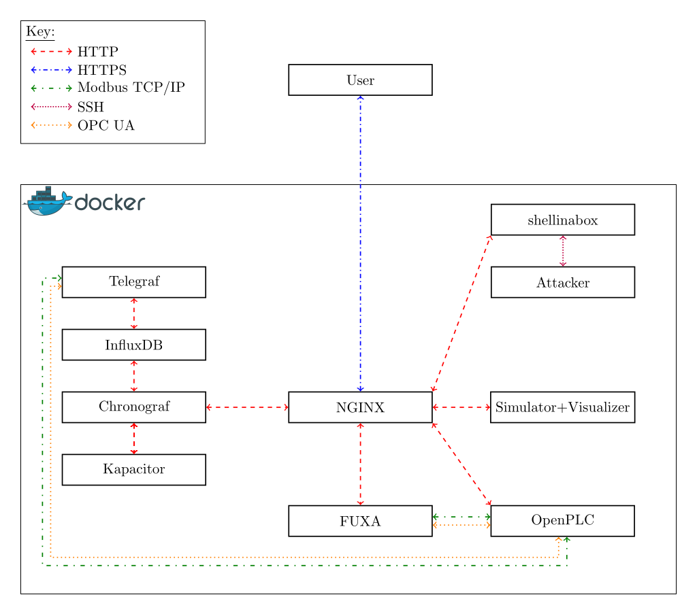

# Technical Details

This chapter covers the technical details of the testbed. 
Beginning with what components are used, followed by the used industrial protocols.
Afterwards, it details how docker is used, and finally it describes how authentication and the PKI is managed.

## Summaryc

This image briefly sums up what components exist in the testbed and what kind of protocols are used.

