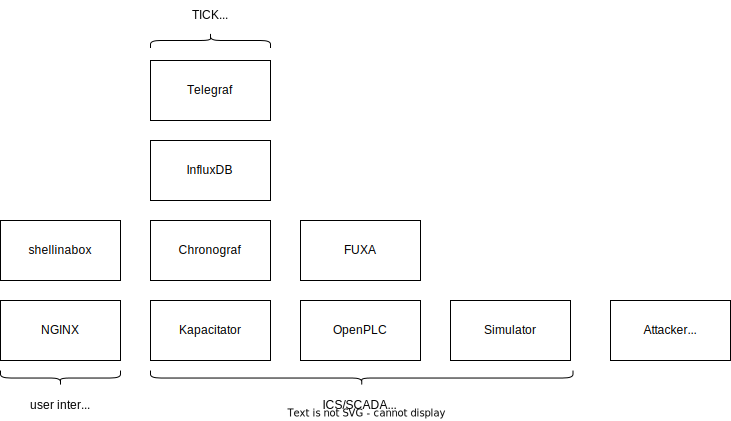

# Virtualization Details

The testbed is virtualized with Docker and docker-compose. Using Docker gives us great flexibility and usability without sacrificing too much fidelity.

## Containers

## NGINX Container

The NGINX container is used to mediate access to individual testbed components, it works as a reverse proxy.
It allows us to authenticate access and protect remote traffic to the testbed with HTTPS.
Which is not supported by multiple testbed components by themselves.

## Linux Capabilities

Some containers require elevated Linux capabilities ([reference](https://man7.org/linux/man-pages/man7/capabilities.7.html)) in order to operate.

|  Container | Capability |  Reason                                                    | 
|------------|------------|------------------------------------------------------------|
| OpenPLC  | SYS_NICE     | increase process priority of processes related PLC runtime |
| OpenPLC  | IPC_LOCK     | lock memory related to PLC runtime                         | 
| Attacker | NET_ADMIN    | enable promiscuous mode                                    |
| Attacker | NET_RAW      | open raw sockets, required for ScaPy                       |