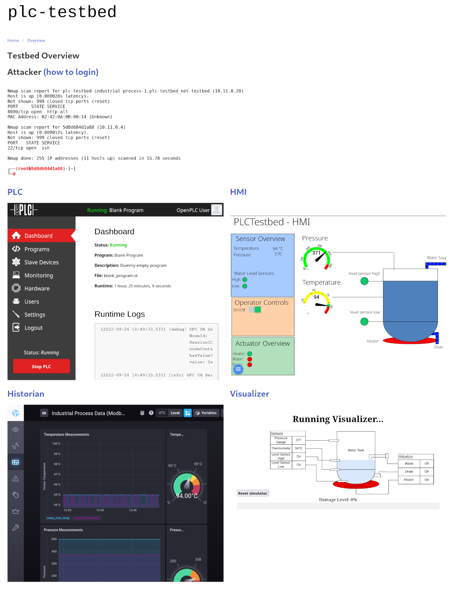

# PLCTestbed

This repository contains a testbed to conduct security experiments within programmable logic controllers (PLC) networks.
It is built with docker and a number of open source components (OpenPLC, FUXA, TICK stack, open62541 and more.)
It encompasses a small network with a PLC, a human machine interface (HMI), a simulated industrial process, a historian
stack, an attacking host.
The testbed can be accessed through a web interface which aggregates the hosts.

**For a Screenshot scroll down below.**

## Maintenance

This project is not actively maintained, however it is *possible* that it will receive fixes in the future.

## Contributing

Contributions are welcome via pull requests. Check out [`CONTRIBUTING.md`](CONTRIBUTING.md) for more details.

## Citation

TBA

## Getting Started

The script `testbed.py` provides functionality such as setting dependencies (Docker, etc.),
building the containers and starting/stopping.

### Installation:

The installation script supports Debian, Ubuntu and ArchLinux.
It is essentially a wrapper around the [official instructions provided by Docker.](https://docs.docker.com/engine/)
The flag `--dont-ask-sudo` can be used to skip the script from asking everytime before running a sudo command.

```shell
./testbed.py --install debian # options are 'debian', 'ubuntu' and 'arch'
```

### Building, Starting and Stopping the testbed

You can build the local version and start it the following way:

```shell
./testbed.py --build local
./testbed.py --start local -d
```

You can replace `local` with one of `{local, prod, dev}`,
however most of the time you will want the local version.

If you want to stop it again you can with:

```shell
./testbed.py --stop
```

## Documentation

**[Documentation about usage is available in this subdirectory](./docs)**, ideally this should be viewed
with [mdBook](https://rust-lang.github.io/mdBook/)
or [accessed from the hosted docs here](https://docs-plctb.aisec.fraunhofer.de/) 


## Screenshot



## Acknowledgement

This work was funded by the German Federal Ministry of Education of Research (BMBF) under the grant number 16KIS0933K.
